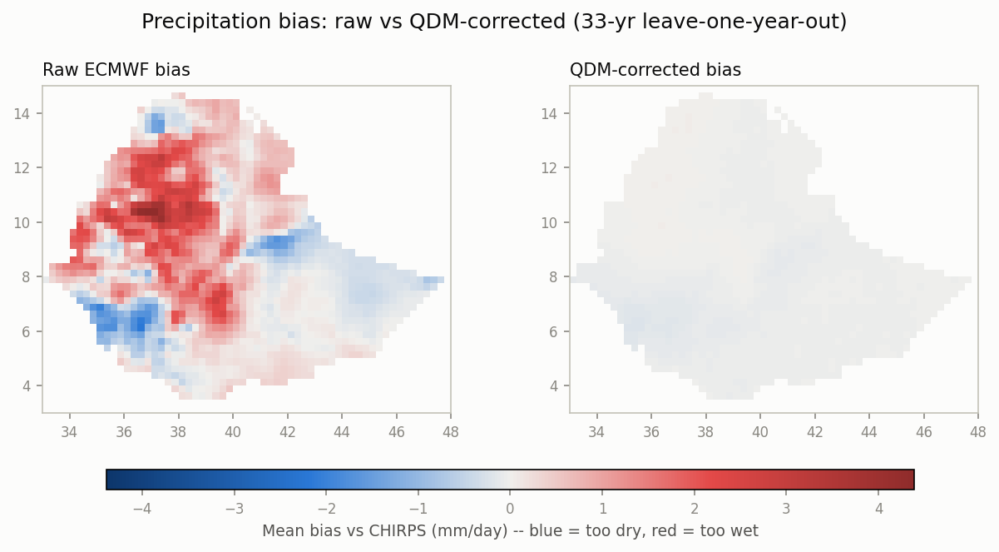
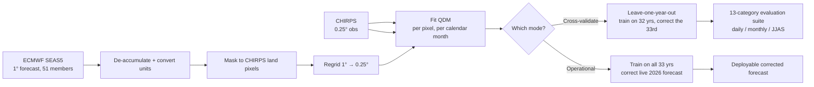
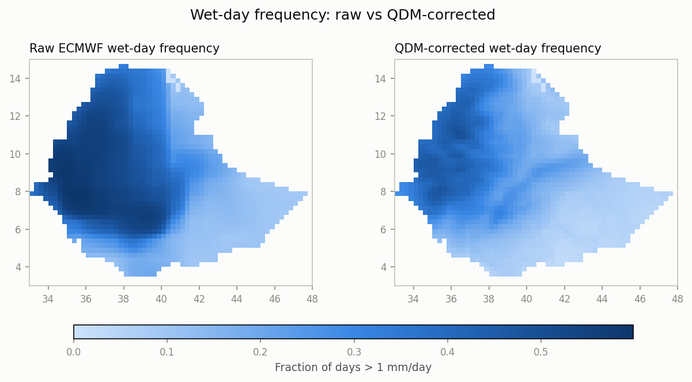
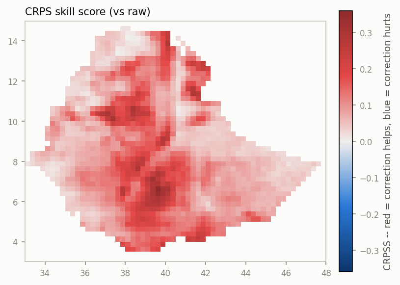
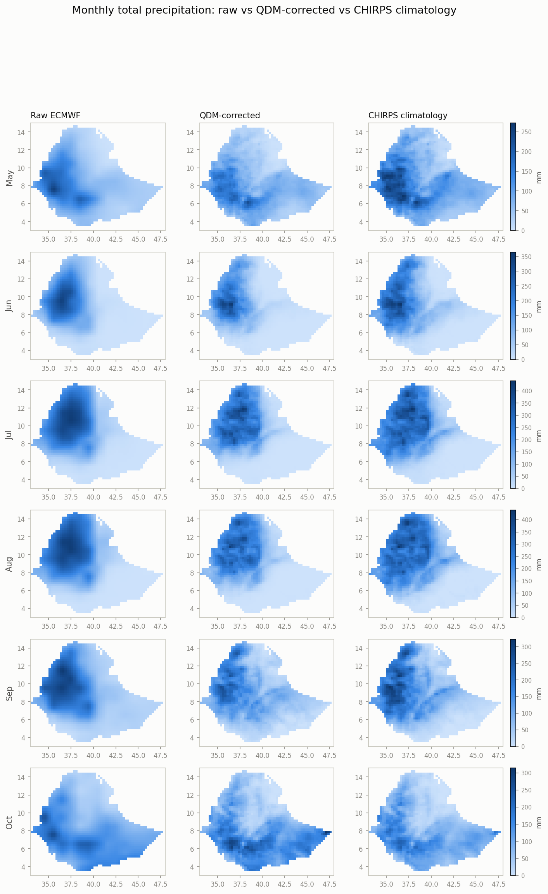
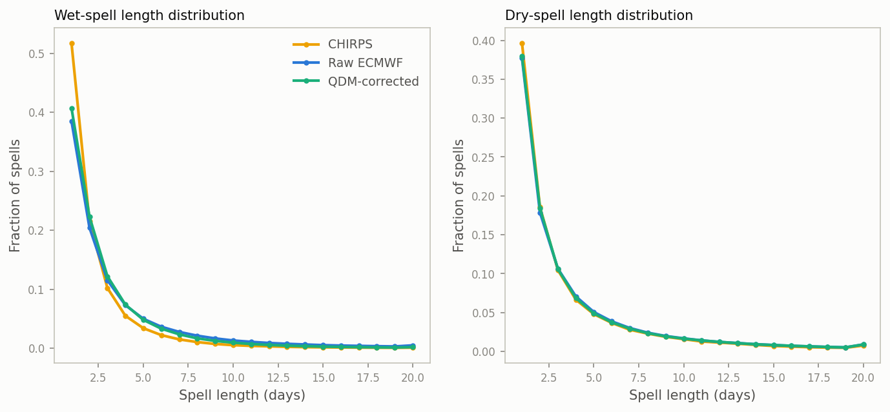
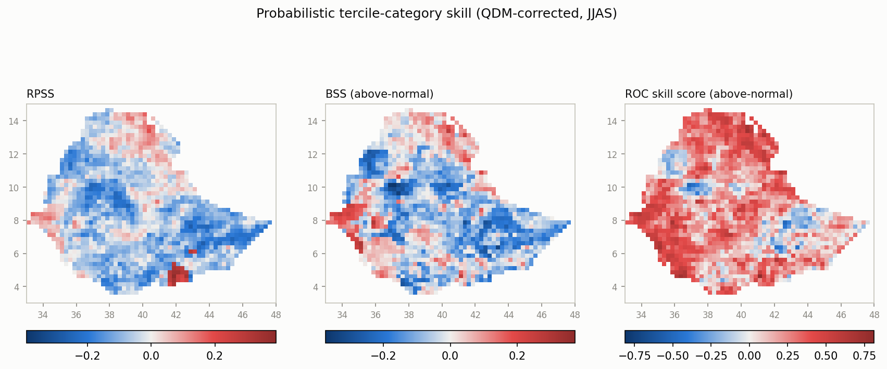
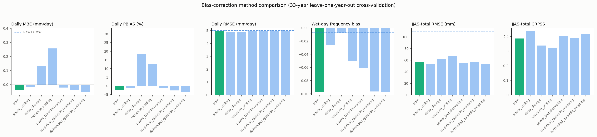
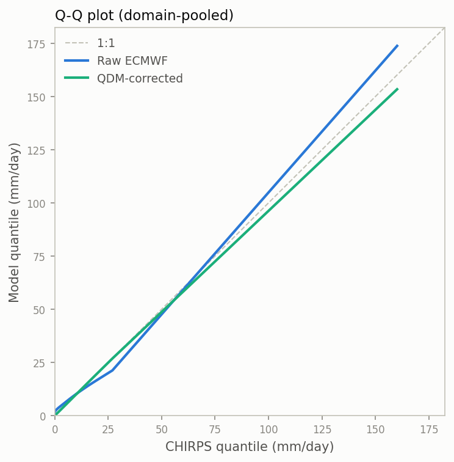

# Spatial Bias Correction - Quantile Delta Mapping (SBC-QDM)

**Bias-correcting ECMWF seasonal rainfall forecasts against CHIRPS observations, for the Horn of Africa (Ethiopia).**


---

## Table of contents

- [The problem](#the-problem)
- [What this does](#what-this-does)
- [Results at a glance](#results-at-a-glance)
- [How it works](#how-it-works)
- [Data](#data)
- [Quickstart](#quickstart)
- [CLI reference](#cli-reference)
- [Evaluation notebooks](#evaluation-notebooks)
- [Full results](#full-results)
- [Method comparison](#method-comparison)
- [Known limitations](#known-limitations)
- [Engineering notes](#engineering-notes-things-that-bit-us-at-full-scale)
- [Repository layout](#repository-layout)
- [Testing & CI](#testing--ci)
- [License & acknowledgments](#license--acknowledgments)

---

## The problem

Raw seasonal forecast output is not directly trustworthy: coarse-resolution global models carry systematic, well-documented wet/dry biases that swamp the actual forecast signal at the scale humanitarian and agricultural decisions need.

This project bias-corrects ECMWF's raw forecast against CHIRPS a
high-resolution, station-blended satellite rainfall product treated as ground truth — over a Horn of Africa domain (roughly Ethiopia and its immediate neighbors, 3.5-14.5°N, 33.5-47.5°E), using 33 years of hindcasts (1993-2025) to learn the correction and validating it the way you'd want before trusting it operationally: **leave-one-year-out cross-validation**,
never scoring a year the model was trained on.


## What this does

- **Quantile Delta Mapping (QDM)**, fit per pixel and per calendar month, correcting the full shape of the forecast distribution not just its mean.
- **Ensemble-aware**: all members pooled for training, corrected
  member-wise so ensemble spread (a proxy for forecast uncertainty) is preserved.
- **Validated honestly**: every skill number reported here comes from leave-one-year-out cross-validation, not in-sample fit quality.
- **Evaluated thoroughly**: All scientific verification suite
  (deterministic bias metrics, distributional similarity, spell persistence, spatial pattern skill, monthly/seasonal skill vs. climatology, probabilistic ensemble skill, calibration) at daily, monthly, and JJAS-seasonal scales  not just "the mean bias went down."
- **Honest about what it doesn't fix**: QDM is a purely marginal correction.
  It doesn't touch day-to-day persistence (wet/dry spell lengths) or the ensemble's ability to discriminate above/below-normal seasons (ROC skill) see [Known limitations](#known-limitations).
- **Benchmarked against 6 alternative correction methods** (Linear Scaling,
  Delta Change, Variance Scaling, Power Transformation, Empirical Quantile
  Mapping, Detrended Quantile Mapping), all run through the identical
  cross-validation and evaluation pipeline so the comparison is apples-to-apples
  — see [Method comparison](#method-comparison).

## Results at a glance

33-year leave-one-year-out cross-validation, domain-mean:

| Metric | Raw ECMWF | Corrected (QDM) |
|---|---|---|
| Mean bias vs. CHIRPS | +0.382 mm/day | **-0.037 mm/day** |
| Daily PBIAS | +31.8% | **-2.5%** |
| Wet-day frequency | 25.3% | **16.3%** (CHIRPS: ~15%) |
| CRPS (lower is better) | 2.040 | **1.843** |
| CRPSS vs. raw | — | **+0.106** |
| JJAS-total RMSE | 110.2 mm | **56.7 mm** (-49%) |

Full breakdown, including where the correction *doesn't* help, in
[Full results](#full-results) below.



*Raw ECMWF (left) vs. QDM-corrected (right) mean daily bias against CHIRPS, clipped to Ethiopia's national boundary, same shared diverging colorbar (blue = too dry, red = too wet, over the 33-year leave-one-year-out cross-validation). The table above is domain-wide; see [Full results](#full-results) for how Ethiopia-only numbers differ.*

These numbers reflect the pipeline's current tail-concentrated quantile grid
(see [Known limitations](#known-limitations) for the extreme-tail fix this
grid was built to address) — the full 33-year cross-validation, evaluation
suite, and 2026 operational forecast have all been re-run under it.

## How it works



**Quantile Delta Mapping**, in one paragraph: for each calendar month, fit
the empirical CDF of both the reference (CHIRPS) and the model (ECMWF,
wet-day-frequency-adjusted via `xsdba.processing.adapt_freq`) across all
hindcast years and ensemble members. For a given raw forecast value, find
its quantile under the model's CDF, look up the ratio between the
reference's and model's value at that same quantile (the "adjustment
factor"), and multiply the raw value by it. This corrects the whole shape of
the distribution — not just the mean — while preserving day-to-day and
member-to-member relative variation, which a simple bias-mean-shift would not.

Why hand-rolled instead of `xsdba.QuantileDeltaMapping` directly: that
library's calendar-aware `Grouper` breaks whenever the training/adjustment
data doesn't span a full calendar year (confirmed on two `xsdba` versions) —
which a single May-initialized, 183-day seasonal forecast never does. The
correction itself is implemented in plain `xarray`/`numpy`; only
`xsdba.processing.adapt_freq` (confirmed to work fine ungrouped) is reused
from the library. See [qdm.py](src/sbc_qdm/qdm.py) for the full
implementation and rationale.

Two training modes share the same underlying fit/apply code
([`train_qdm`](src/sbc_qdm/qdm.py) / [`apply_qdm`](src/sbc_qdm/qdm.py)):

- **`leave_one_year_out`** — train on 32 years, correct the 33rd, repeat for
  every year. This is how the numbers in this README were produced: no year
  is ever corrected by a model that saw it during training.
- **`apply_operational`** — train once on the full 33-year record, correct
  the live operational forecast (2026). This is the actual deployment path.

## Data

| Dataset | Role | Grid | Notes |
|---|---|---|---|
| [CHIRPS v2.0](https://www.chc.ucsb.edu/data/chirps) | Observational reference | 0.25°, 48×60 pixels | Daily precip, mm/day, 1993-2025 |
| [ECMWF SEAS5](https://www.ecmwf.int/en/forecasts/dataset/seasonal-forecast) | Forecast to correct | 1°, 12×15 pixels | Single May initialization/year, 51-member ensemble, 51-day-to-5-month lead |

Both datasets cover 3.5-14.5°N, 33.5-47.5°E (ECMWF's coarser grid sets the
limiting extent). ECMWF is regridded onto CHIRPS' 0.25° grid before
correction, so all skill scores are reported at CHIRPS' native resolution.

### Data quirks worth knowing before touching this pipeline

- **ECMWF `tp` is accumulated-since-init, not a per-day value**, despite its
  `GRIB_stepType` metadata saying "instant". `preprocess.deaccumulate()`
  handles this. If new ECMWF files are ever added, sanity-check with
  `preprocess.diagnose_accumulation()` before trusting the assumption.
- **Ensemble size changes at the 2017 boundary**: ECMWF hindcasts (1993-2016)
  have 25 members; operational/near-real-time years (2017+) have 51.
  `pipeline.prepare_target_year()` clips 2017+ forecasts back down to 25
  members (`config/domain.yaml: ensemble.hindcast_n_members`) so corrected
  output has a consistent ensemble size across years. During training, the
  size mismatch is handled by NaN-padding + `skipna=True` quantile/adapt_freq
  calls — verified harmless, no special-casing needed there.
- **CHIRPS' merged reference can have year-sized gaps** if a source download
  was incomplete (this happened for 2017; the `.nc.part` file for 2017 was
  never merged in). `pipeline.prepare_hindcast()` intersects CHIRPS' and
  ECMWF's time indices rather than assuming full coverage, so a gap just
  drops those dates from both sides instead of crashing. If you add a
  missing year's CHIRPS data later, rebuild the merged reference (see
  ["Rebuilding the CHIRPS reference"](#rebuilding-the-chirps-reference)
  below) and rerun cross-validation — every fold's training pool changes
  when a year is added, so cached `output/loyo_folds/*.nc` results must be
  regenerated, not just appended to.

## Quickstart

```bash
conda env create -f environment.yml
conda activate sbc-qdm
pip install -e .
```

or with plain pip (`environment.yml`'s dependency list mirrors `pyproject.toml`):

```bash
pip install -e ".[dev]"
```

The `geo` extra (`geopandas`, `shapely`) is only needed for
`sbc_qdm.verify.boundary` (country-shapefile clipping, e.g. the
Ethiopia-only evaluation notebook) — not the core CLI pipeline:

```bash
pip install -e ".[dev,geo]"
```

Then, once `data/` is populated (see [Data](#data) — not committed to this
repo, ~2.4GB):

```bash
sbc-qdm cross-validate     # judge whether the method is trustworthy (~3.5hr at full scale)
sbc-qdm plot-diagnostics   # look at where/how it helps or hurts spatially
sbc-qdm evaluate           # full scientific evaluation suite (~4hr at full scale)
sbc-qdm apply              # produce the deployable, bias-corrected operational forecast
```

Each step's output feeds the next; see [CLI reference](#cli-reference) for
what each one actually needs as input and produces.

## CLI reference

All commands read `config/domain.yaml` by default (`--config` to override).

### `sbc-qdm train`

Fits QDM on the full hindcast record (no year held out) and saves the
trained adjustment factors/quantiles for later reuse.

```bash
sbc-qdm train
```

Output: `output/qdm_trained.nc` (`af` and `hist_q` per month).

### `sbc-qdm cross-validate`

Runs the full leave-one-year-out cross-validation: trains on all-but-one
hindcast year, corrects that year, for every year present in the hindcast.
This is how you validate the method before trusting an operational
correction, and it's what produces the bias/CRPSS/rank-histogram numbers you
should look at before applying anything for real.

```bash
sbc-qdm cross-validate
```

Drives one **subprocess per year** internally (see `cross-validate-fold`
below) rather than looping in-process — long-running, memory-heavy
single-process loops on this project repeatedly hit fragmentation/deadlock
issues at full domain/ensemble scale (see
[Engineering notes](#engineering-notes-things-that-bit-us-at-full-scale) below).
Resumable: existing `output/loyo_folds/{year}.nc` files are skipped, so a
killed/crashed run can just be re-invoked as-is.

Outputs:
- `output/loyo_folds/{year}.nc` — per-fold corrected year (intermediate, kept for resumability)
- `output/loyo_corrected.nc` — all folds concatenated into one corrected hindcast
- `output/loyo_diagnostics.nc` — bias maps, wet-day frequency, CRPS/CRPSS, rank histograms (pre vs post correction)

### `sbc-qdm cross-validate-fold --year YYYY`

Runs a single leave-one-year-out fold. This is what `cross-validate` shells
out to; call it directly only for debugging a specific year in isolation.

```bash
sbc-qdm cross-validate-fold --year 2013
```

### `sbc-qdm apply [--year YYYY]`

The actual production step: trains on the **entire** hindcast record (all
years, nothing held out) and applies that single trained model to correct
the operational forecast year (defaults to `config["time"]["operational_year"]`,
currently 2026).

```bash
sbc-qdm apply
sbc-qdm apply --year 2027   # once a 2027 forecast file exists
```

Output: `output/corrected_{year}.nc`.

### `sbc-qdm validate`

Recomputes the diagnostics dataset from `output/loyo_corrected.nc` (running
`cross-validate` first if it doesn't exist yet) and prints a domain-mean
summary. Useful if you've changed `validate.py` and want fresh diagnostics
without repeating the (expensive) fold training.

```bash
sbc-qdm validate
```

### `sbc-qdm plot-diagnostics`

Renders the spatial/distributional figures from `output/loyo_diagnostics.nc`
(running `validate` first if it doesn't exist yet).

```bash
sbc-qdm plot-diagnostics
```

Output, all under `output/figures/`:
- `bias_maps.png` — raw vs corrected mean bias, diverging (blue=dry, red=wet), shared colorbar
- `wet_day_frequency.png` — raw vs corrected fraction of days > 1 mm/day, shared sequential colorbar
- `crps.png` — raw vs corrected CRPS, shared sequential colorbar (lower is better)
- `crpss.png` — CRPS skill score map (red = correction helps, blue = correction hurts)
- `rank_histogram.png` — raw vs corrected ensemble rank histogram, log-scale y-axis (the rank-0
  dry-day spike is ~40x taller than everything else on a linear scale). Note the visible
  discontinuity at rank 25/26: hindcast years with only 25 members can never register above
  rank 25 in this pooled histogram, so the two halves aren't perfectly apples-to-apples —
  a real artifact of the ensemble-size change, not a bug.

### `sbc-qdm evaluate`

The full scientific evaluation suite: daily / monthly / JJAS-seasonal, spatial,
raw vs QDM-corrected. Requires `output/loyo_corrected.nc` (runs `cross-validate`
first if missing). See [`src/sbc_qdm/verify/`](src/sbc_qdm/verify/) for the
implementation — `aggregate.py` (monthly/JJAS aggregation, climatology, tercile
categories), `deterministic.py` (MBE/MAE/PBIAS/RMSE/SD & CV ratio),
`distributions.py` (Q-Q/ECDF/PDF, quantile bias, wet-day frequency bias),
`spells.py` (wet/dry spell length distributions), `skill.py` (ACC/Spearman
ACC/RMSESS/interannual variability ratio — temporal skill vs climatology),
`probabilistic.py` (CRPS/CRPSS, RPSS, Brier Score/BSS, ROC, scored against
CHIRPS-derived tercile categories), `calibration.py` (reliability diagrams,
spread-skill ratio), `spatial.py` (pattern correlation, spatial RMSE — skill
across pixels for a fixed time, the complement to `skill.py`'s
per-pixel-across-years view).

```bash
sbc-qdm evaluate
```

This is expensive: the full 33-year/full-domain run took **~4.3 hours**,
dominated by the domain-pooled Q-Q/ECDF/PDF distributions (~2.5h) and the
wet/dry spell-length extraction (~1.4h) — both are plain Python loops over
every pixel/member series (streamed in (lat,lon) tiles to stay memory-bounded,
see `verify/aggregate.py`'s `iter_spatial_blocks`), which doesn't vectorize.
Everything else (deterministic/skill/probabilistic maps) takes minutes.

Output under `output/evaluation/`:
- `daily_deterministic.nc` — MBE/MAE/PBIAS/RMSE/SD & CV ratio, quantile bias
  (Q10/50/90/95), wet-day frequency bias, spread-skill ratio; raw & corrected
- `qq_pairs.nc`, `spell_lengths.npz` — domain-pooled Q-Q pairs and raw
  wet/dry spell-length samples (obs/raw/corrected)
- `daily_spatial_timeseries.nc` — spatial correlation/pattern correlation/RMSE, one value per day
- `monthly_deterministic_and_skill.nc` — deterministic + ACC/Spearman/RMSESS/IVR, per calendar month
- `jjas_deterministic_and_skill.nc` — same, for the JJAS season total
- `jjas_probabilistic.nc` — RPSS, BSS & ROC skill score (below/near/above-normal tercile categories), CRPS/CRPSS
- `figures/` — 13 curated PNGs (not one-per-metric-per-scale; the netCDF
  files above hold the full daily/monthly/JJAS breakdown for anything not
  separately plotted)

## Evaluation notebooks

[`notebooks/evaluation_report.ipynb`](notebooks/evaluation_report.ipynb)
walks through every figure and summary table in the full evaluation suite
(Sections 1-7: daily diagnostics, deterministic metrics, distributional
similarity, spell persistence, spatial performance, monthly/JJAS skill vs
climatology, probabilistic ensemble skill) with an explanation after each
plot — the same findings as [Full results](#full-results) below, in
narrative form — plus two sections on the live 2026 operational forecast
itself: Section 8 (JJAS seasonal total, raw vs corrected) and Section 9
(month-by-month raw vs corrected vs the 1993-2025 CHIRPS climatology, both
as raw totals and as anomalies). Every code cell calls the real
`sbc_qdm.viz`/`sbc_qdm.verify.viz` plotting functions against cached numeric
results, not a re-implementation — the two exceptions (domain-pooled
ECDF/PDF, and the reliability diagram's underlying per-year tercile
probabilities) are noted inline where the notebook shows real source instead
of re-executing an expensive full-domain rescan. It's pre-executed (all
cells have cached outputs already embedded) and only reads from `output/` —
it does not re-run the correction or evaluation pipeline. Rebuild it after a
fresh `sbc-qdm evaluate` run with:

```bash
python -m nbconvert --to notebook --execute --inplace notebooks/evaluation_report.ipynb
```

Built by [`notebooks/build_evaluation_report.py`](notebooks/build_evaluation_report.py).

### Ethiopia-clipped variant

[`notebooks/evaluation_report_ethiopia.ipynb`](notebooks/evaluation_report_ethiopia.ipynb)
is the same report clipped to Ethiopia's national boundary
(`data/eth_shapefile/eth_admin0.shp`, loaded via
`sbc_qdm.verify.boundary.load_country_mask`). Ethiopia's actual shape excludes
a substantial fraction of the original domain — only 55.9% of the domain's
land pixels (1,484 of 2,657) fall inside its border, the rest being Somalia,
parts of Kenya, Eritrea, Djibouti, and South Sudan that shared the same
bounding box — so results genuinely differ in places (e.g. raw PBIAS +14.5%
for Ethiopia vs +31.8% domain-wide; interannual variability ratio improves
toward 1.0 after correction within Ethiopia vs moving further away
domain-wide).

Per-pixel results (bias/deterministic/skill/probabilistic maps, the 2026
forecast sections, and even the two pooled-but-cheap quantities — rank
histogram and spatial pattern correlation, both under 90s to recompute) are
genuinely Ethiopia-only. The two truly expensive steps (domain-pooled
Q-Q/ECDF/PDF, and wet/dry spell-length extraction — ~2.5hr and ~1.4hr in the
original run) are **not** re-scanned Ethiopia-only, since masking doesn't
reduce their block-wise scan cost (see `verify/aggregate.py`'s
`iter_spatial_blocks`); those two sections keep the original full-domain
results, clearly noted inline rather than silently reused. Rebuild it (after
a fresh `sbc-qdm evaluate` run, or if the shapefile changes) with the same
`nbconvert` command, pointed at `evaluation_report_ethiopia.ipynb`. Built by
[`notebooks/build_evaluation_report_ethiopia.py`](notebooks/build_evaluation_report_ethiopia.py).

## Full results

**33-year leave-one-year-out cross-validation** (`output/loyo_diagnostics.nc`):

| Metric | Raw ECMWF | Corrected (QDM) |
|---|---|---|
| Mean bias vs CHIRPS | +0.382 mm/day | -0.037 mm/day |
| Wet-day frequency | 25.3% | 16.3% |
| CRPS (lower is better) | 2.040 | 1.843 |
| CRPSS (skill vs raw) | -- | +0.106 |

**2026 operational application** (`output/corrected_2026.nc`):

| | Raw | Corrected |
|---|---|---|
| Mean daily precip | 2.61 mm/day | 2.21 mm/day |
| Wet-day frequency | 35.7% | 21.9% |

The correction reduces mean bias by roughly an order of magnitude and
corrects ECMWF's tendency to rain too often (too lightly), with a positive
CRPS skill score under honest (not in-sample) cross-validation.

<table>
<tr>
<td width="50%"></td>
<td width="50%"></td>
</tr>
</table>

*Ethiopia-clipped. Left: ECMWF rains far too often, too lightly — QDM corrects wet-day frequency down toward CHIRPS' ~15%. Right: CRPSS map — red where the correction improves probabilistic skill over raw, blue where it hurts.*



*Ethiopia-clipped. The live 2026 operational forecast, month by month: raw ECMWF, QDM-corrected, and the 33-year CHIRPS climatology for comparison. From `notebooks/evaluation_report_ethiopia.ipynb` Section 9.*

**Full scientific evaluation suite** (`output/evaluation/`, domain means, raw vs corrected):

| Scale | Metric | Raw | Corrected |
|---|---|---|---|
| Daily | MBE (mm/day) | +0.38 | -0.04 |
| Daily | PBIAS | +31.8% | -2.5% |
| Daily | MAE (mm/day) | 3.08 | 2.85 |
| Daily | RMSE (mm/day) | 5.03 | 4.95 |
| Daily | SD ratio (ensemble mean) | 0.42 | 0.42 |
| JJAS total | MBE (mm) | +56.8 | -4.8 |
| JJAS total | RMSE (mm) | 110.2 | 56.7 |
| JJAS total | CRPS | 72.8 | 32.6 |
| JJAS total | CRPSS | -- | +0.39 |
| JJAS total | ACC | 0.242 | 0.202 |
| JJAS total | RPSS (tercile) | -0.264 | -0.053 |
| JJAS total | BSS, above-normal | -0.218 | -0.026 |
| JJAS total | ROC skill, above-normal | 0.246 | 0.243 |

**What this reveals that the simpler daily diagnostics didn't:**
- Bias correction is thorough at every scale (PBIAS, JJAS-total RMSE/CRPS all
  improve substantially — RMSE cut ~49% and CRPS ~55% at the JJAS-seasonal-total
  scale, where random day-to-day noise cancels out and the systematic bias fix
  dominates).
- QDM is a **purely marginal** correction, and it shows: ensemble-mean daily
  variance (SD ratio, ~0.42 both before and after) and tercile-discrimination
  ability (ROC skill, ~0.246 both before and after) are essentially
  **unchanged**. RPSS/BSS improve substantially (calibration gets better) while
  ROC skill doesn't move (ranking ability was already there, or wasn't, and
  QDM doesn't touch it) — textbook-consistent with QDM fixing probability
  *calibration* without improving *discrimination*.
- ACC actually **drops slightly** (0.242 -> 0.202) after correction — a real,
  if small, trade-off worth knowing about, not hidden by the aggregate CRPSS
  improvement.
- The Q-Q plot (`figures/qq_plot.png`) shows corrected quantiles tracking
  CHIRPS closely through the bulk of the distribution, but **diverging above
  both the raw forecast and CHIRPS' own range above ~Q95** — see
  [Known limitations](#known-limitations) below.
- Wet/dry spell-length distributions (`figures/spell_distributions.png`) are
  **barely changed** by the correction — CHIRPS shows a much sharper spike
  at 1-day wet spells than either raw or corrected reproduce. Expected: QDM
  corrects each day's magnitude independently and has no mechanism to fix
  day-to-day persistence/sequencing.
- Skill is spatially heterogeneous (`figures/jjas_probabilistic_skill.png`):
  RPSS/BSS are positive in the northeast of the domain but negative through
  the central-south, while ROC skill is strongly positive almost everywhere
  — i.e. the ensemble discriminates above-normal seasons reasonably well
  nearly everywhere, but its absolute probability calibration is still poor
  in the central/southern part of the domain even where discrimination is fine.

<table>
<tr>
<td width="50%"></td>
<td width="50%"></td>
</tr>
</table>

*Left: wet/dry spell-length distributions (domain-wide — this is one of the two expensive full-scan steps not re-run Ethiopia-only, see [Evaluation notebooks](#evaluation-notebooks)) — QDM leaves persistence essentially untouched. Right: JJAS probabilistic skill (RPSS/BSS/ROC), Ethiopia-clipped — good discrimination almost everywhere within Ethiopia, but calibration lags in the south.*

## Method comparison

Is QDM actually worth its complexity, or would something simpler do just as
well? `sbc-qdm compare-methods` answers that by running 6 alternative
bias-correction methods through the *identical* leave-one-year-out
cross-validation and evaluation pipeline as QDM — same data, same metrics,
same domain-mean aggregation — so the comparison is apples-to-apples rather
than borrowed from different papers' different setups.

| Method | Idea |
|---|---|
| **Linear Scaling** | Corrects only the mean: one multiplicative ratio per pixel/month (Lenderink et al. 2007). Simplest possible correction — leaves variance, extremes, and wet-day frequency untouched. |
| **Delta Change (DC)** | The additive counterpart to Linear Scaling — corrects the mean via a difference rather than a ratio. Also leaves spread/shape untouched. |
| **Variance Scaling** | Extends Delta Change with a spread correction: rescales anomalies by the ratio of standard deviations after removing the mean bias (Chen et al. 2011). |
| **Power Transformation** | Corrects mean and coefficient of variation via a fitted exponent (Leander & Buishand 2007) — handles precipitation's right-skew multiplicatively instead of needing to clip negative values. |
| **Empirical Quantile Mapping (EQM)** | Plain quantile mapping: substitutes the raw value with the reference's value at the same quantile. Corrects the full distribution shape like QDM, but discards how the target period's own magnitude might differ from the training climatology at a given rank. |
| **Detrended Quantile Mapping (DQM)** | Cannon et al. (2015)'s refinement of EQM — normalizes the target period by its own mean before quantile-mapping, then re-applies that mean-shift afterward, preserving signal EQM's direct substitution would discard. |
| **QDM** (this project's default) | Cannon et al. (2015) — maps the *ratio/delta* at a given quantile onto the raw value, rather than substituting it outright, combining EQM's distribution-shape correction with DC's signal-preservation. |

See [`src/sbc_qdm/methods/`](src/sbc_qdm/methods/) for the full implementation
and references of each — every module's docstring explains the method and how
it's adapted to this pipeline's leave-one-year-out setting (the classical
"delta change" framing assumes a historical-vs-future scenario that doesn't
map cleanly onto cross-validating a single historical period).

```bash
sbc-qdm compare-methods
```

Resumable exactly like `cross-validate`/`evaluate` (skips any method/stage
whose output already exists), and cleans up each method's per-fold cache
directory (~6.7GB each) once both its cross-validation and evaluation stages
are confirmed complete, since keeping all of them simultaneously across 6+
methods gets expensive fast. Output under `output/methods/{method}/` (mirrors
the single-method CLI layout) and `output/method_comparison/`
(`comparison_summary.nc`, `comparison.png`).



**33-year leave-one-year-out cross-validation, domain means:**

| Method | Daily PBIAS | Daily RMSE (mm/day) | JJAS-total RMSE (mm) | JJAS-total CRPSS |
|---|---|---|---|---|
| Raw ECMWF | +31.8% | 5.03 | 110.2 | -- |
| QDM | -2.5% | 4.95 | 56.7 | +0.386 |
| Linear Scaling | -1.1% | 4.89 | 52.8 | **+0.437** |
| Delta Change | +18.3% | 4.91 | 61.2 | +0.338 |
| Variance Scaling | +12.5% | 4.96 | 67.3 | +0.324 |
| Power Transformation | -1.4% | 4.95 | 55.5 | +0.405 |
| Empirical Quantile Mapping | -2.7% | 4.95 | 56.6 | +0.387 |
| Detrended Quantile Mapping | -3.5% | 4.95 | 53.7 | +0.419 |

**What this reveals:**
- **The three quantile-mapping methods (QDM, EQM, DQM) land within a whisker
  of each other** on every aggregate metric here — expected, since all three
  share the same quantile grid and `adapt_freq` wet-day preprocessing
  (deliberately, so the comparison isn't confounded by different resolution
  choices) and differ mainly in how they handle the target period's own
  signal, a distinction these domain-mean metrics aren't designed to surface.
- **Delta Change and Variance Scaling leave substantial bias behind**
  (PBIAS +18.3% and +12.5%, both still over half the raw forecast's +31.8%)
  — consistent with both methods correcting the mean/spread of the *whole*
  distribution at once rather than mapping through it quantile-by-quantile,
  so they can't correct a bias that varies across the distribution's range.
- **Linear Scaling — the simplest method here — actually posts the best
  JJAS-total RMSE and CRPSS**, edging out QDM. This isn't a knock against
  QDM: JJAS-total RMSE and CRPSS are aggregate, mean-focused skill scores,
  exactly where a mean-correcting method should do well, and exactly the
  scores that don't capture what QDM buys you elsewhere (wet-day frequency,
  the shape of the daily distribution, and the extreme-tail behavior covered
  in [Known limitations](#known-limitations) below). It's a genuine, useful
  data point, not swept under the rug — if all you need is a seasonal-total
  forecast, Linear Scaling is a serious, far cheaper option.
- **Wet-day frequency correction is where the quantile-mapping methods pull
  ahead clearly** (visible in the comparison figure's fourth panel): QDM, EQM,
  and DQM all apply a much larger wet-day-frequency correction than Delta
  Change or Power Transformation, since only the quantile-mapping methods use
  `adapt_freq` to directly target ECMWF's tendency to drizzle too often.

## Known limitations

Being upfront about what this pipeline does *not* fix, rather than leaving
it implicit:

- **QDM has no mechanism to fix day-to-day persistence.** Wet/dry spell-length
  distributions are barely changed by correction (see above) — it corrects
  each day's magnitude independently.
- **Tercile-discrimination ability (ROC skill) is unchanged by correction.**
  QDM improves probability calibration (RPSS/BSS), not the ensemble's
  underlying ability to rank above/below-normal seasons correctly.
- **Anomaly correlation (ACC) drops slightly after correction** (0.242 ->
  0.202, JJAS-total) — a real, small trade-off alongside the much larger
  calibration gains.



*Corrected quantiles track CHIRPS closely through most of the distribution, then overshoot both raw ECMWF and CHIRPS' own observed range above ~Q95 — the extreme-tail amplification explained below.*

**Extreme-tail amplification** (the most involved issue, worth its own
explanation): Q95+ quantiles get amplified *beyond* both the raw forecast
and CHIRPS' own observed range in the Q-Q plot. This was traced to an exact
mechanism, not left as a vague caveat: `numpy.interp` clamps rather than
extrapolates past the last quantile node (originally tau=0.99), so *any* raw
value above that node's threshold gets the same flat adjustment factor
regardless of how extreme it actually is. The domain's single most extreme
corrected 2026 value occurs at lat 7.625°N, lon 47.125°E, 2026-10-22, ensemble
member 22: raw 61.06mm corrected to **243.75mm** under the original 50-node
grid — CHIRPS' own October historical maximum at that exact pixel is
234.57mm, so the old grid overshot the observational record there by ~4%.
(An earlier version of this investigation reported a neighboring pixel,
7.875°N, with a "134mm CHIRPS max" — a pixel mislocation, not this one;
precipitation extremes vary substantially between adjacent 0.25° cells
there, so that number was simply wrong and has been corrected here.) See
`notebooks/evaluation_report.ipynb` Section 8.1 for the full investigation.
**Practical takeaway: don't treat the corrected output's upper tail as
reliable for extreme-sensitive uses (flood risk, design storms) without this
caveat in mind.**

`qdm.py` now concentrates extra quantile nodes in the tail (0.995/0.998/
0.999/0.9995, via `config/domain.yaml`'s `qdm.tail_quantiles`) instead of
stopping flat at 0.99. Verified on the exact pixel above, using the full
33-year hindcast (not a small live-reproduced subset): the same raw value
now maps to **231.61mm** — this time *below* CHIRPS' 234.57mm historical
max at that pixel, i.e. the fix fully resolves the overshoot in this case,
confirmed both by an isolated single-pixel retrain and by the actual
`output/corrected_2026.nc` produced by the full pipeline (values match to
5 significant figures). The root cause is still that `numpy.interp` clamps
rather than extrapolates for *any* value past its last given node, so extra
nodes only push the clamping point further into the tail rather than
eliminating clamping altogether — a raw value extreme enough to exceed even
the extended range would still be clamped. A complete fix would need genuine
tail extrapolation (e.g. a fitted distribution beyond the last empirical
quantile), which is a bigger modeling decision than this change and hasn't
been implemented. Note also that `qdm.extrapolation: constant` in the config
is currently descriptive only — the clamping behavior comes from
`numpy.interp`'s hardcoded default, not from that field actually being read
anywhere in the code.

A quick domain-wide scan (comparing each pixel's 2026 corrected max, across
all months/members, against CHIRPS' historical max at that same pixel/month)
still finds several hundred pixels per month where the corrected max exceeds
the historical one. That is **not**, on its own, evidence the fix is
incomplete: 2026's corrected forecast has 25 ensemble members × ~30 days per
month (750 samples) against CHIRPS' 33 single yearly values per month, so
some number of new-record values are expected from sample-size alone, not
necessarily from residual clamping. Distinguishing genuine residual overshoot
from this sampling effect would need a more careful analysis (e.g. comparing
the *old* grid's exceedance count/magnitude against the *new* grid's, pixel
by pixel) than has been done here — flagged as a follow-up, not resolved.

The full 33-year cross-validation, the 2026 operational forecast, and the
evaluation suite have now been re-run with this fix (see [Full results](#full-results) — those numbers already reflect the new quantile grid); the two
evaluation notebooks still need rebuilding against the fresh output, which
hasn't happened yet as of this writing.

## Rebuilding the CHIRPS reference

If you add or fix a year's CHIRPS data (each year has a `chirps-v2.0.{year}.days_p25_clip.nc`
file under `data/chirps_pr_et/`), rebuild the merged reference before rerunning
anything:

```python
import xarray as xr
from pathlib import Path

clip_dir = Path("data/chirps_pr_et")
years = range(1993, 2026)
datasets = [xr.open_dataset(clip_dir / f"chirps-v2.0.{y}.days_p25_clip.nc") for y in years]
merged = xr.concat(datasets, dim="time")
merged.to_netcdf(clip_dir / "et_chirps_pr_r25_1993_2025.nc")
```

Then delete `output/loyo_folds/` (every fold's training pool changes when a
year is added or fixed) and rerun `sbc-qdm cross-validate` from scratch.

## Engineering notes (things that bit us at full scale)

These are baked into the code already, documented here so a future change
doesn't accidentally reintroduce them:

- **netCDF4/HDF5 writes are not reliably thread-safe.** `qdm.py` sets a
  process-wide threaded dask scheduler for training/adjustment performance;
  writing a large, multi-chunk dask array to netCDF under that same threaded
  scheduler deadlocked silently for 18+ hours (using ~20s of actual CPU time)
  during the cross-validation combine step. `cli.py` forces
  `dask.config.set(scheduler="synchronous")` around every `.to_netcdf()` call
  on a lazy array. If you add a new write path, wrap it the same way.
- **This project's dev machine has had as little as ~0.5 GiB of free system
  memory** under normal desktop load (VS Code, browser, etc.), unrelated to
  this pipeline. `regrid.py` and `qdm.py` chunk spatially (5x5 to 10x10
  tiles) specifically to keep peak per-chunk memory in the tens-of-MB range.
  If you hit `MemoryError` on a fresh run, it's very likely ambient system
  pressure, not a regression — check `df -h` (disk) and available RAM before
  assuming a code bug, and simply resume (`cross-validate` is safe to
  re-invoke).
- **`xsdba.QuantileDeltaMapping`'s calendar-aware `Grouper` is broken for
  sub-annual data** — confirmed on two `xsdba` versions, reproduced even
  when adjusting the exact array used for training. This is why `qdm.py`
  hand-rolls per-month grouping in plain xarray instead of using
  `xsdba.QuantileDeltaMapping` directly; only `xsdba.processing.adapt_freq`
  (which works fine ungrouped) is reused from the library.

## Repository layout

```
config/domain.yaml          Paths, bbox, ensemble/QDM parameters
src/sbc_qdm/
  config.py                 Loads domain.yaml, resolves paths
  io.py                     load_chirps_reference(), load_ecmwf_year/hindcast/operational()
  preprocess.py              De-accumulation, unit conversion, land/water masking
  regrid.py                  Bilinear ECMWF -> CHIRPS regrid (dask-chunked)
  qdm.py                     Per-month multiplicative QDM: train/apply/cross-validate/operational
  pipeline.py                 Composes io -> preprocess -> regrid into ready-to-use arrays
  validate.py                 Bias maps, wet-day frequency, CRPS/CRPSS, rank histogram
  viz.py                       Spatial/distributional figures from a diagnostics dataset
  verify/                       Full scientific evaluation suite (see "sbc-qdm evaluate" above)
    aggregate.py                 Monthly/JJAS aggregation, climatology, tercile categories
    deterministic.py             MBE, MAE, PBIAS, RMSE, SD ratio, CV ratio
    distributions.py             Q-Q/ECDF/PDF, quantile bias, wet-day frequency bias
    spells.py                    Wet/dry spell length distributions
    skill.py                     ACC, Spearman ACC, RMSESS, interannual variability ratio
    probabilistic.py             CRPS/CRPSS, RPSS, Brier Score/BSS, ROC
    calibration.py                Reliability diagrams, spread-skill ratio
    spatial.py                    Spatial pattern correlation, spatial RMSE
    viz.py / run.py                Figures + orchestration for the whole suite
    boundary.py                    Country-shapefile clipping (geopandas + shapely.vectorized)
  cli.py                       train | cross-validate | cross-validate-fold | apply | validate | plot-diagnostics | evaluate
notebooks/                    Evaluation report notebooks + the scripts that build them
tests/                        Unit tests (synthetic) + integration tests (require data/)
output/                       All CLI outputs land here, including output/figures/ and output/evaluation/
```

## Testing & CI

```bash
pytest tests/ -v
```

Two kinds of tests, split by whether they need the real (uncommitted, ~2.4GB)
`data/` directory:

- `tests/test_verify.py` — synthetic, hand-constructed arrays with known
  expected outputs, covering all 9 `verify/` modules. No dependency on
  `data/`, runs in a couple of seconds.
- `tests/test_io_preprocess.py` / `tests/test_regrid_qdm.py` — integration
  checks against the real project data files, marked `requires_data` (see
  `pyproject.toml`'s `[tool.pytest.ini_options]`). Skip these with:

  ```bash
  pytest -m "not requires_data" -v
  ```

**CI** ([`.github/workflows/tests.yml`](.github/workflows/tests.yml)) runs
exactly that CI-safe subset on every push/PR, since `data/` isn't available
on the runner. Locally, with `data/` present, just run `pytest tests/ -v`
for the full suite.

## License & acknowledgments

Code in this repository is released under the [MIT License](LICENSE).

- **[CHIRPS](https://www.chc.ucsb.edu/data/chirps)** (Climate Hazards Center
  InfraRed Precipitation with Station data), produced by the Climate Hazards
  Center at UC Santa Barbara in partnership with USGS and others — used here
  as the observational reference. See CHIRPS' own site for its data license
  and citation guidance.
- **ECMWF SEAS5**, the seasonal forecast system whose reforecasts/forecasts
  are corrected here. See ECMWF's terms for redistribution of derived
  products before sharing corrected output publicly.

This README documents the pipeline as of the latest evaluation run; see
[Full results](#full-results) and [Known limitations](#known-limitations)
for exactly what's been validated and what hasn't.
